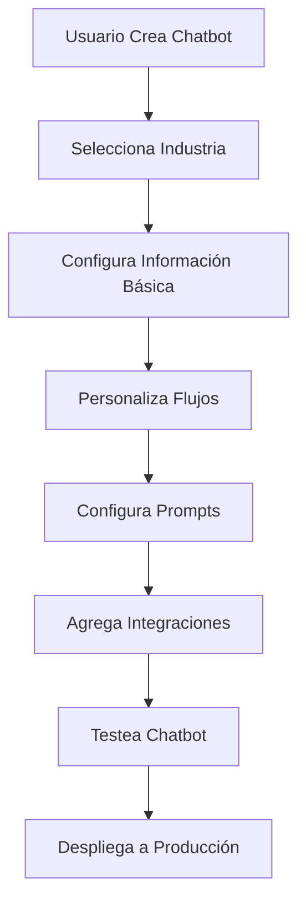
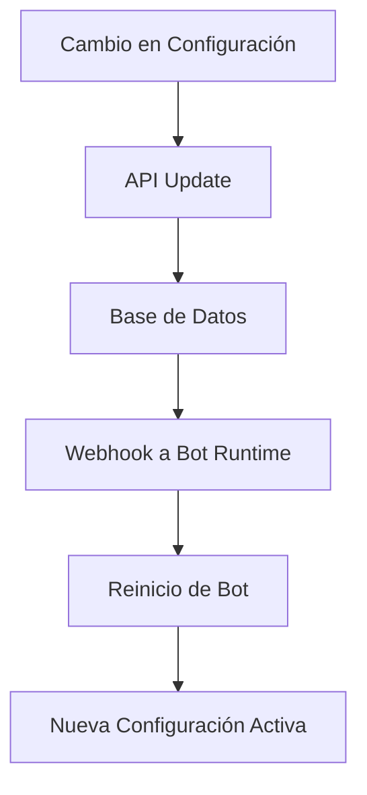
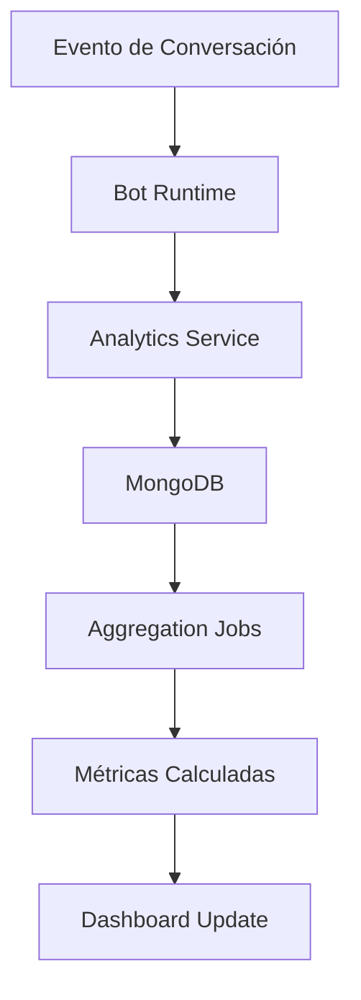

# Sistema de Administración y Configuración de Chatbots

## 🎯 Visión General

Sistema completo de administración para crear, configurar y gestionar chatbots personalizados para diferentes industrias, con dashboard de métricas y configuración visual.

---

## 🏗️ Arquitectura del Sistema

### **1. Frontend (Admin Portal)**

```
┌─────────────────────────────────────────────────────────────┐
│                    ADMIN PORTAL (Next.js)                   │
├─────────────────────────────────────────────────────────────┤
│  ┌─────────────┐  ┌─────────────┐  ┌─────────────┐        │
│  │ Dashboard   │  │ Chatbot     │  │ Analytics   │        │
│  │ Overview    │  │ Builder     │  │ & Reports   │        │
│  └─────────────┘  └─────────────┘  └─────────────┘        │
├─────────────────────────────────────────────────────────────┤
│  ┌─────────────┐  ┌─────────────┐  ┌─────────────┐        │
│  │ User        │  │ Template    │  │ Integration │        │
│  │ Management  │  │ Manager     │  │ Manager     │        │
│  └─────────────┘  └─────────────┘  └─────────────┘        │
├─────────────────────────────────────────────────────────────┤
│  ┌─────────────┐  ┌─────────────┐  ┌─────────────┐        │
│  │ Billing     │  │ Settings    │  │ Support     │        │
│  │ & Plans     │  │ & Security  │  │ & Help      │        │
│  └─────────────┘  └─────────────┘  └─────────────┘        │
└─────────────────────────────────────────────────────────────┘
```

### **2. Backend (Microservices)**

```
┌─────────────────────────────────────────────────────────────┐
│                 MICROSERVICES ARCHITECTURE                  │
├─────────────────────────────────────────────────────────────┤
│  ┌─────────────┐  ┌─────────────┐  ┌─────────────┐        │
│  │ User        │  │ Chatbot     │  │ Analytics   │        │
│  │ Service     │  │ Service     │  │ Service     │        │
│  │ (Auth)      │  │ (Core)      │  │ (Metrics)   │        │
│  └─────────────┘  └─────────────┘  └─────────────┘        │
├─────────────────────────────────────────────────────────────┤
│  ┌─────────────┐  ┌─────────────┐  ┌─────────────┐        │
│  │ Config      │  │ Template    │  │ Notification│        │
│  │ Service     │  │ Service     │  │ Service     │        │
│  │ (Settings)  │  │ (Prompts)   │  │ (Alerts)    │        │
│  └─────────────┘  └─────────────┘  └─────────────┘        │
├─────────────────────────────────────────────────────────────┤
│  ┌─────────────┐  ┌─────────────┐  ┌─────────────┐        │
│  │ Billing     │  │ Integration │  │ Bot         │        │
│  │ Service     │  │ Service     │  │ Runtime     │        │
│  │ (Payments)  │  │ (APIs)      │  │ (Execution) │        │
│  └─────────────┘  └─────────────┘  └─────────────┘        │
└─────────────────────────────────────────────────────────────┘
```

### **3. Base de Datos**

```
┌─────────────────────────────────────────────────────────────┐
│                    DATABASE LAYER                           │
├─────────────────────────────────────────────────────────────┤
│  ┌─────────────┐  ┌─────────────┐  ┌─────────────┐        │
│  │ PostgreSQL  │  │ Redis       │  │ MongoDB     │        │
│  │ (Main Data) │  │ (Cache)     │  │ (Analytics) │        │
│  │ - Users     │  │ - Sessions  │  │ - Events    │        │
│  │ - Chatbots  │  │ - Tokens    │  │ - Metrics   │        │
│  │ - Configs   │  │ - Rate Lim  │  │ - Logs      │        │
│  └─────────────┘  └─────────────┘  └─────────────┘        │
└─────────────────────────────────────────────────────────────┘
```

---

## 🎨 Frontend - Admin Portal

### **1. Dashboard Principal**

```typescript
// pages/dashboard/index.tsx
interface DashboardProps {
  user: User
  chatbots: Chatbot[]
  metrics: DashboardMetrics
}

export const Dashboard: React.FC<DashboardProps> = ({ user, chatbots, metrics }) => {
  return (
    <div className="dashboard">
      <Header user={user} />
      
      <div className="dashboard-grid">
        {/* Métricas Rápidas */}
        <MetricsOverview metrics={metrics} />
        
        {/* Lista de Chatbots */}
        <ChatbotsList chatbots={chatbots} />
        
        {/* Actividad Reciente */}
        <RecentActivity />
        
        {/* Gráficos de Performance */}
        <PerformanceCharts />
      </div>
    </div>
  )
}
```

### **2. Chatbot Builder**

```typescript
// pages/chatbot/builder/[id].tsx
interface ChatbotBuilderProps {
  chatbotId: string
  industry: Industry
  config: ChatbotConfig
}

export const ChatbotBuilder: React.FC<ChatbotBuilderProps> = ({ 
  chatbotId, 
  industry, 
  config 
}) => {
  const [currentStep, setCurrentStep] = useState<'basic' | 'flows' | 'prompts' | 'integrations'>('basic')
  
  return (
    <div className="chatbot-builder">
      <BuilderHeader chatbotId={chatbotId} currentStep={currentStep} />
      
      <div className="builder-content">
        {/* Sidebar de Configuración */}
        <BuilderSidebar 
          currentStep={currentStep}
          onStepChange={setCurrentStep}
        />
        
        {/* Área de Configuración */}
        <BuilderMain>
          {currentStep === 'basic' && (
            <BasicConfig 
              config={config.basic}
              industry={industry}
            />
          )}
          
          {currentStep === 'flows' && (
            <FlowBuilder 
              flows={config.flows}
              industry={industry}
            />
          )}
          
          {currentStep === 'prompts' && (
            <PromptManager 
              prompts={config.prompts}
              industry={industry}
            />
          )}
          
          {currentStep === 'integrations' && (
            <IntegrationManager 
              integrations={config.integrations}
            />
          )}
        </BuilderMain>
      </div>
    </div>
  )
}
```

### **3. Flow Builder Visual**

```typescript
// components/FlowBuilder/FlowBuilder.tsx
interface FlowBuilderProps {
  flows: Flow[]
  industry: Industry
  onFlowUpdate: (flows: Flow[]) => void
}

export const FlowBuilder: React.FC<FlowBuilderProps> = ({ 
  flows, 
  industry, 
  onFlowUpdate 
}) => {
  const [selectedFlow, setSelectedFlow] = useState<Flow | null>(null)
  
  return (
    <div className="flow-builder">
      {/* Toolbar */}
      <FlowToolbar 
        industry={industry}
        onAddFlow={(flow) => onFlowUpdate([...flows, flow])}
      />
      
      {/* Canvas de Flujo */}
      <FlowCanvas 
        flow={selectedFlow}
        onFlowUpdate={(updatedFlow) => {
          const updatedFlows = flows.map(f => 
            f.id === updatedFlow.id ? updatedFlow : f
          )
          onFlowUpdate(updatedFlows)
        }}
      />
      
      {/* Panel de Propiedades */}
      <FlowProperties 
        flow={selectedFlow}
        onPropertyUpdate={(property, value) => {
          if (selectedFlow) {
            const updatedFlow = { ...selectedFlow, [property]: value }
            setSelectedFlow(updatedFlow)
          }
        }}
      />
    </div>
  )
}
```

### **4. Prompt Manager**

```typescript
// components/PromptManager/PromptManager.tsx
interface PromptManagerProps {
  prompts: Prompt[]
  industry: Industry
  onPromptUpdate: (prompts: Prompt[]) => void
}

export const PromptManager: React.FC<PromptManagerProps> = ({ 
  prompts, 
  industry, 
  onPromptUpdate 
}) => {
  const [selectedPrompt, setSelectedPrompt] = useState<Prompt | null>(null)
  
  return (
    <div className="prompt-manager">
      {/* Lista de Prompts */}
      <PromptList 
        prompts={prompts}
        industry={industry}
        onSelectPrompt={setSelectedPrompt}
      />
      
      {/* Editor de Prompt */}
      <PromptEditor 
        prompt={selectedPrompt}
        industry={industry}
        onPromptUpdate={(updatedPrompt) => {
          const updatedPrompts = prompts.map(p => 
            p.id === updatedPrompt.id ? updatedPrompt : p
          )
          onPromptUpdate(updatedPrompts)
        }}
      />
      
      {/* Variables y Contexto */}
      <PromptVariables 
        prompt={selectedPrompt}
        industry={industry}
      />
    </div>
  )
}
```

---

## 🔧 Backend - Microservices

### **1. User Service**

```typescript
// services/user-service/src/index.ts
import express from 'express'
import { PrismaClient } from '@prisma/client'
import { authMiddleware } from './middleware/auth'
import { userRoutes } from './routes/user'
import { organizationRoutes } from './routes/organization'

const app = express()
const prisma = new PrismaClient()

app.use(express.json())
app.use(authMiddleware)

// Rutas
app.use('/api/users', userRoutes)
app.use('/api/organizations', organizationRoutes)

// Health check
app.get('/health', (req, res) => {
  res.json({ status: 'healthy', service: 'user-service' })
})

app.listen(3001, () => {
  console.log('User Service running on port 3001')
})
```

### **2. Chatbot Service**

```typescript
// services/chatbot-service/src/index.ts
import express from 'express'
import { PrismaClient } from '@prisma/client'
import { chatbotRoutes } from './routes/chatbot'
import { configRoutes } from './routes/config'
import { deploymentRoutes } from './routes/deployment'

const app = express()
const prisma = new PrismaClient()

app.use(express.json())

// Rutas
app.use('/api/chatbots', chatbotRoutes)
app.use('/api/configs', configRoutes)
app.use('/api/deployments', deploymentRoutes)

// Webhook para actualizaciones de bots
app.post('/webhook/bot-update', async (req, res) => {
  const { chatbotId, config } = req.body
  
  try {
    // Actualizar configuración del bot
    await updateBotConfig(chatbotId, config)
    
    // Reiniciar bot con nueva configuración
    await restartBot(chatbotId)
    
    res.json({ success: true })
  } catch (error) {
    res.status(500).json({ error: error.message })
  }
})

app.listen(3002, () => {
  console.log('Chatbot Service running on port 3002')
})
```

### **3. Analytics Service**

```typescript
// services/analytics-service/src/index.ts
import express from 'express'
import { MongoClient } from 'mongodb'
import { analyticsRoutes } from './routes/analytics'
import { metricsRoutes } from './routes/metrics'

const app = express()
const mongoClient = new MongoClient(process.env.MONGODB_URI!)

app.use(express.json())

// Rutas
app.use('/api/analytics', analyticsRoutes)
app.use('/api/metrics', metricsRoutes)

// Event tracking
app.post('/api/events', async (req, res) => {
  const { chatbotId, event, data, timestamp } = req.body
  
  try {
    await trackEvent(chatbotId, event, data, timestamp)
    res.json({ success: true })
  } catch (error) {
    res.status(500).json({ error: error.message })
  }
})

app.listen(3003, () => {
  console.log('Analytics Service running on port 3003')
})
```

---

## 🗄️ Base de Datos

### **1. PostgreSQL Schema**

```sql
-- Usuarios y Organizaciones
CREATE TABLE users (
  id UUID PRIMARY KEY DEFAULT gen_random_uuid(),
  email VARCHAR(255) UNIQUE NOT NULL,
  password_hash VARCHAR(255) NOT NULL,
  first_name VARCHAR(100),
  last_name VARCHAR(100),
  role USER_ROLE DEFAULT 'user',
  organization_id UUID REFERENCES organizations(id),
  created_at TIMESTAMP DEFAULT NOW(),
  updated_at TIMESTAMP DEFAULT NOW()
);

CREATE TABLE organizations (
  id UUID PRIMARY KEY DEFAULT gen_random_uuid(),
  name VARCHAR(255) NOT NULL,
  plan PLAN_TYPE DEFAULT 'starter',
  settings JSONB DEFAULT '{}',
  created_at TIMESTAMP DEFAULT NOW(),
  updated_at TIMESTAMP DEFAULT NOW()
);

-- Chatbots y Configuraciones
CREATE TABLE chatbots (
  id UUID PRIMARY KEY DEFAULT gen_random_uuid(),
  name VARCHAR(255) NOT NULL,
  organization_id UUID REFERENCES organizations(id),
  industry_id UUID REFERENCES industries(id),
  status BOT_STATUS DEFAULT 'draft',
  config JSONB NOT NULL,
  webhook_url VARCHAR(500),
  created_at TIMESTAMP DEFAULT NOW(),
  updated_at TIMESTAMP DEFAULT NOW()
);

CREATE TABLE industries (
  id UUID PRIMARY KEY DEFAULT gen_random_uuid(),
  name VARCHAR(100) NOT NULL,
  description TEXT,
  templates JSONB DEFAULT '{}',
  flows JSONB DEFAULT '{}',
  created_at TIMESTAMP DEFAULT NOW()
);

-- Conversaciones y Métricas
CREATE TABLE conversations (
  id UUID PRIMARY KEY DEFAULT gen_random_uuid(),
  chatbot_id UUID REFERENCES chatbots(id),
  user_id VARCHAR(255) NOT NULL,
  platform PLATFORM_TYPE NOT NULL,
  status CONVERSATION_STATUS DEFAULT 'active',
  metadata JSONB DEFAULT '{}',
  created_at TIMESTAMP DEFAULT NOW(),
  updated_at TIMESTAMP DEFAULT NOW()
);

CREATE TABLE messages (
  id UUID PRIMARY KEY DEFAULT gen_random_uuid(),
  conversation_id UUID REFERENCES conversations(id),
  content TEXT NOT NULL,
  role MESSAGE_ROLE NOT NULL,
  timestamp TIMESTAMP DEFAULT NOW(),
  metadata JSONB DEFAULT '{}'
);

-- Integraciones
CREATE TABLE integrations (
  id UUID PRIMARY KEY DEFAULT gen_random_uuid(),
  chatbot_id UUID REFERENCES chatbots(id),
  type INTEGRATION_TYPE NOT NULL,
  name VARCHAR(100) NOT NULL,
  config JSONB NOT NULL,
  status INTEGRATION_STATUS DEFAULT 'active',
  created_at TIMESTAMP DEFAULT NOW(),
  updated_at TIMESTAMP DEFAULT NOW()
);
```

### **2. MongoDB Collections**

```javascript
// Analytics Events
db.events.createIndex({ "chatbotId": 1, "timestamp": -1 })
db.events.createIndex({ "event": 1, "timestamp": -1 })

// Metrics Aggregations
db.metrics.createIndex({ "chatbotId": 1, "date": -1 })
db.metrics.createIndex({ "organizationId": 1, "date": -1 })

// Conversation Logs
db.conversationLogs.createIndex({ "chatbotId": 1, "timestamp": -1 })
db.conversationLogs.createIndex({ "userId": 1, "timestamp": -1 })
```

---

## 🚀 Funcionalidades Principales

### **1. Dashboard de Administración**

#### **Métricas Principales**
- **Chatbots Activos**: Número total de chatbots desplegados
- **Conversaciones Totales**: Total de conversaciones iniciadas
- **Tasa de Conversión**: Porcentaje de conversaciones exitosas
- **Tiempo de Respuesta**: Promedio de tiempo de respuesta del bot

#### **Gráficos y Reportes**
- **Conversaciones por Día**: Gráfico de líneas temporal
- **Performance por Chatbot**: Comparación de métricas
- **Horarios Pico**: Análisis de actividad por hora
- **Satisfacción del Cliente**: NPS y ratings

### **2. Chatbot Builder**

#### **Configuración Básica**
- **Información del Negocio**: Nombre, ubicación, descripción
- **Horarios de Atención**: Configuración por día de la semana
- **Servicios y Precios**: Lista de servicios con precios
- **Métodos de Pago**: Configuración de pagos aceptados

#### **Flow Builder Visual**
- **Drag & Drop**: Interfaz visual para crear flujos
- **Nodos Configurables**: AI Response, Data Collection, Integration
- **Validaciones**: Reglas de validación personalizables
- **Testing**: Simulador de conversaciones

#### **Prompt Manager**
- **Templates**: Plantillas predefinidas por industria
- **Variables**: Sistema de variables dinámicas
- **Preview**: Vista previa de prompts generados
- **Versioning**: Control de versiones de prompts

### **3. Analytics y Reportes**

#### **Métricas en Tiempo Real**
- **Conversaciones Activas**: Número de conversaciones en curso
- **Tiempo de Respuesta**: Métricas de performance
- **Errores**: Tracking de errores y fallos

#### **Reportes Personalizados**
- **Filtros Avanzados**: Por fecha, chatbot, industria
- **Exportación**: PDF, Excel, CSV
- **Scheduling**: Reportes automáticos por email

### **4. Gestión de Usuarios**

#### **Roles y Permisos**
- **Super Admin**: Acceso completo al sistema
- **Organization Admin**: Gestión de chatbots de la organización
- **Chatbot Manager**: Gestión de chatbots específicos
- **Viewer**: Solo visualización de métricas

#### **Organizaciones**
- **Multi-tenant**: Soporte para múltiples organizaciones
- **Planes y Límites**: Restricciones por plan de suscripción
- **Branding**: Personalización de marca

---

## 🔄 Flujo de Trabajo

### **1. Creación de Chatbot**



### **2. Configuración Dinámica**



### **3. Analytics Pipeline**



---

## 🛠️ Stack Tecnológico Recomendado

### **Frontend**
- **Next.js 14**: Framework React con App Router
- **TypeScript**: Tipado estático
- **Tailwind CSS**: Styling utility-first
- **Shadcn/ui**: Componentes UI
- **React Flow**: Flow builder visual
- **Recharts**: Gráficos y visualizaciones

### **Backend**
- **Node.js**: Runtime JavaScript
- **Express.js**: Framework web
- **Prisma**: ORM para PostgreSQL
- **MongoDB**: Base de datos para analytics
- **Redis**: Cache y sesiones
- **JWT**: Autenticación

### **Infraestructura**
- **Docker**: Containerización
- **Kubernetes**: Orquestación
- **PostgreSQL**: Base de datos principal
- **MongoDB**: Analytics y logs
- **Redis**: Cache y rate limiting
- **Nginx**: Reverse proxy

### **DevOps**
- **GitHub Actions**: CI/CD
- **AWS/GCP**: Cloud hosting
- **Terraform**: Infrastructure as Code
- **Prometheus**: Monitoring
- **Grafana**: Dashboards

---

## 💰 Modelo de Negocio

### **Pricing Tiers**

#### **Starter - $29/mes**
- 1 organización
- 3 chatbots
- Configuración básica
- Analytics básicos
- Soporte por email

#### **Professional - $99/mes**
- 1 organización
- 10 chatbots
- Configuración avanzada
- Analytics completos
- Integraciones premium
- Soporte prioritario

#### **Enterprise - $299/mes**
- Organizaciones ilimitadas
- Chatbots ilimitados
- Configuración personalizada
- Analytics avanzados
- Integraciones personalizadas
- Soporte dedicado

### **Revenue Streams**
1. **Suscripciones mensuales** por plan
2. **Integraciones premium** (CRM, ERP, etc.)
3. **Servicios de configuración** personalizada
4. **Soporte y consultoría** especializada
5. **Marketplace de templates** por industria

---

## 🚀 Roadmap de Implementación

### **Fase 1: MVP (3 meses)**
- [ ] Sistema de autenticación básico
- [ ] Dashboard principal
- [ ] Chatbot builder básico
- [ ] Configuración de prompts
- [ ] Deploy de bots

### **Fase 2: Analytics (2 meses)**
- [ ] Sistema de tracking de eventos
- [ ] Métricas básicas
- [ ] Reportes simples
- [ ] Dashboard de analytics

### **Fase 3: Avanzado (3 meses)**
- [ ] Flow builder visual
- [ ] Integraciones avanzadas
- [ ] Multi-tenancy
- [ ] Billing system

### **Fase 4: Enterprise (2 meses)**
- [ ] Roles y permisos avanzados
- [ ] API pública
- [ ] Marketplace
- [ ] Soporte enterprise

---

## 🎯 Ventajas Competitivas

### **1. Time-to-Market**
- Configuración visual sin código
- Templates predefinidos por industria
- Deploy automático

### **2. Escalabilidad**
- Arquitectura microservicios
- Multi-tenancy nativo
- Auto-scaling

### **3. Flexibilidad**
- Configuración granular
- Integraciones extensibles
- APIs personalizables

### **4. Analytics Avanzados**
- Métricas en tiempo real
- Reportes personalizados
- Insights de negocio

---

*Documentación generada el: $(date)*
*Versión: 1.0.0*

